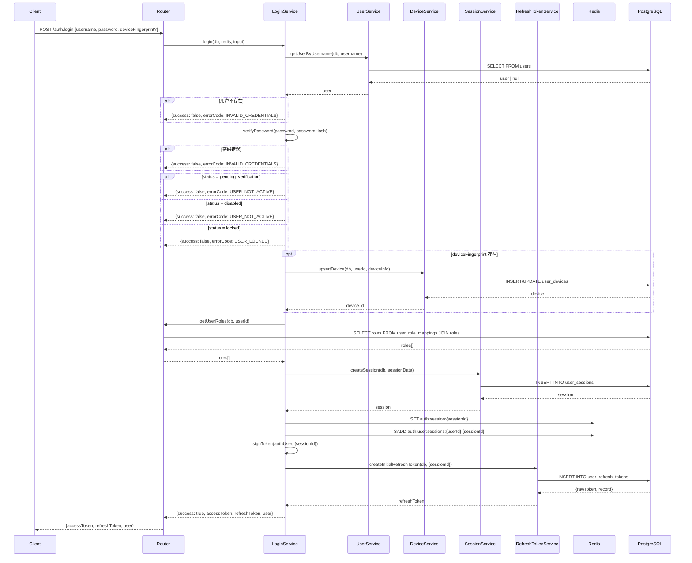
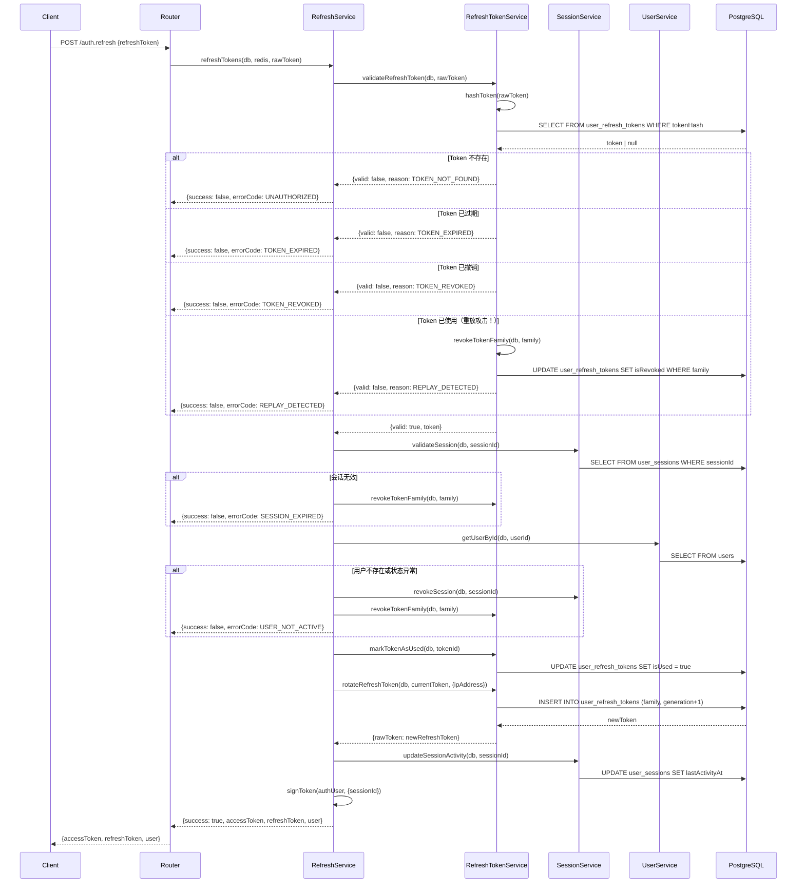
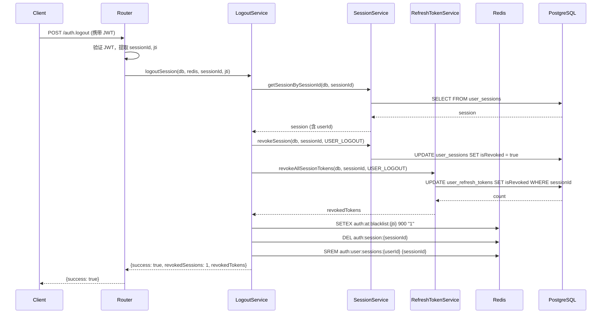
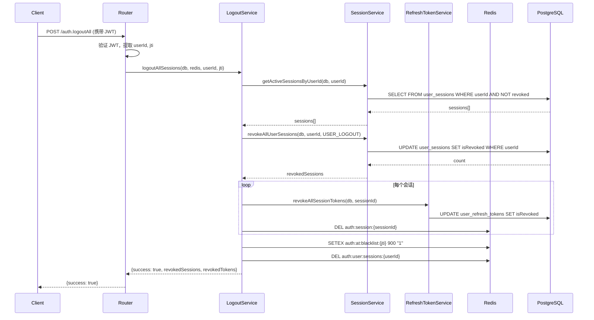
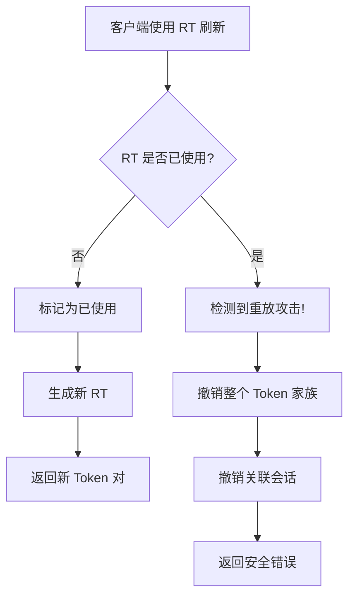

## 核心流程

### 1. 用户登录流程 (login)



---

### 2. Token 刷新流程 (refresh)



---

### 3. 单会话登出流程 (logout)



---

### 4. 全设备登出流程 (logoutAll)



---

## Redis 键设计

| Key 模式                      | 数据类型      | TTL                      | 用途                               |
| ----------------------------- | ------------- | ------------------------ | ---------------------------------- |
| `auth:at:blacklist:{jti}`     | String        | 15min (AT 过期时间)      | AT 黑名单，用于主动失效已发放的 AT |
| `auth:session:{sessionId}`    | String (JSON) | 30 天 (Session 过期时间) | Session 缓存，加速会话验证         |
| `auth:user:sessions:{userId}` | Set           | 无 (手动管理)            | 用户活跃会话列表，快速查询在线设备 |

### Session 缓存数据结构

```typescript
interface SessionCacheData {
  userId: string;
  sessionId: string;
  deviceId?: string;
  isRevoked: boolean;
  expiresAt: number; // timestamp
}
```

---

## 路由设计

### 公开接口 (publicProcedure)

| 路由           | 方法     | 描述       | 输入                                                                 |
| -------------- | -------- | ---------- | -------------------------------------------------------------------- |
| `auth.login`   | mutation | 用户登录   | `{username, password, deviceFingerprint?, deviceName?, deviceType?}` |
| `auth.refresh` | mutation | 刷新 Token | `{refreshToken}`                                                     |

### 需认证接口 (protectedProcedure)

| 路由                 | 方法     | 描述             | 输入          |
| -------------------- | -------- | ---------------- | ------------- |
| `auth.me`            | query    | 获取当前用户信息 | -             |
| `auth.logout`        | mutation | 单设备登出       | -             |
| `auth.logoutAll`     | mutation | 全设备登出       | -             |
| `auth.sessions`      | query    | 获取所有活跃会话 | -             |
| `auth.revokeSession` | mutation | 撤销指定会话     | `{sessionId}` |
| `auth.devices`       | query    | 获取所有设备     | -             |
| `auth.trustDevice`   | mutation | 设置设备为可信   | `{deviceId}`  |
| `auth.untrustDevice` | mutation | 取消设备信任     | `{deviceId}`  |
| `auth.removeDevice`  | mutation | 删除设备         | `{deviceId}`  |

---

## Token 安全机制

### Access Token (AT)

- **类型**: JWT
- **有效期**: 15 分钟
- **存储**: 客户端 (内存/localStorage)
- **验证**: 无状态验证 + Redis 黑名单检查
- **失效**: 自然过期 或 加入黑名单

### Refresh Token (RT)

- **类型**: 随机字符串 (base64url, 32 字节)
- **有效期**: 7 天
- **存储**: PostgreSQL (仅存哈希值)
- **安全机制**:
  - **Token 轮换**: 每次刷新生成新 RT，旧 RT 立即标记为已使用
  - **家族追踪**: 同一会话的所有 RT 共享 `family` 标识
  - **重放检测**: 已使用的 RT 被重复使用时，撤销整个家族

### 重放攻击防护



---

## 数据模型

### user_sessions (用户会话表)

| 字段           | 类型         | 说明                   |
| -------------- | ------------ | ---------------------- |
| id             | UUID         | 主键                   |
| userId         | UUID         | 用户 ID                |
| sessionId      | VARCHAR(255) | 会话唯一标识 (关联 RT) |
| ipAddress      | VARCHAR(50)  | 登录 IP                |
| userAgent      | TEXT         | 浏览器 UA              |
| deviceId       | UUID         | 设备 ID (可选)         |
| isRevoked      | BOOLEAN      | 是否已撤销             |
| revokedAt      | TIMESTAMP    | 撤销时间               |
| revokeReason   | VARCHAR(100) | 撤销原因               |
| lastActivityAt | TIMESTAMP    | 最后活跃时间           |
| expiresAt      | TIMESTAMP    | 过期时间 (30 天)       |

### user_refresh_tokens (刷新令牌表)

| 字段          | 类型         | 说明              |
| ------------- | ------------ | ----------------- |
| id            | UUID         | 主键              |
| sessionId     | VARCHAR(255) | 关联会话 ID       |
| tokenHash     | VARCHAR(255) | Token SHA256 哈希 |
| family        | VARCHAR(255) | Token 家族标识    |
| generation    | INTEGER      | 代数 (轮换次数)   |
| parentTokenId | UUID         | 父 Token ID       |
| isUsed        | BOOLEAN      | 是否已使用        |
| usedAt        | TIMESTAMP    | 使用时间          |
| isRevoked     | BOOLEAN      | 是否已撤销        |
| expiresAt     | TIMESTAMP    | 过期时间 (7 天)   |

### user_devices (用户设备表)

| 字段              | 类型         | 说明         |
| ----------------- | ------------ | ------------ |
| id                | UUID         | 主键         |
| userId            | UUID         | 用户 ID      |
| deviceFingerprint | VARCHAR(255) | 设备指纹     |
| deviceName        | VARCHAR(255) | 设备名称     |
| deviceType        | VARCHAR(50)  | 设备类型     |
| isTrusted         | BOOLEAN      | 是否可信     |
| isDisabled        | BOOLEAN      | 是否禁用     |
| lastActiveAt      | TIMESTAMP    | 最后活跃时间 |

---

## 错误代码

| 代码                     | 常量                | 说明               |
| ------------------------ | ------------------- | ------------------ |
| AUTH_INVALID_CREDENTIALS | INVALID_CREDENTIALS | 用户名或密码错误   |
| AUTH_USER_NOT_ACTIVE     | USER_NOT_ACTIVE     | 用户未激活或已禁用 |
| AUTH_USER_LOCKED         | USER_LOCKED         | 用户已锁定         |
| AUTH_SESSION_EXPIRED     | SESSION_EXPIRED     | 会话已过期         |
| AUTH_SESSION_REVOKED     | SESSION_REVOKED     | 会话已撤销         |
| AUTH_TOKEN_EXPIRED       | TOKEN_EXPIRED       | Token 已过期       |
| AUTH_TOKEN_REVOKED       | TOKEN_REVOKED       | Token 已撤销       |
| AUTH_TOKEN_USED          | TOKEN_USED          | Token 已使用       |
| AUTH_REPLAY_DETECTED     | REPLAY_DETECTED     | 检测到重放攻击     |
| AUTH_UNAUTHORIZED        | UNAUTHORIZED        | 未授权             |

---

## 时间配置

| 配置项                  | 值          | 说明                 |
| ----------------------- | ----------- | -------------------- |
| AT_EXPIRES_IN_SECONDS   | 900 (15min) | Access Token 有效期  |
| RT_EXPIRES_IN_DAYS      | 7           | Refresh Token 有效期 |
| SESSION_EXPIRES_IN_DAYS | 30          | 会话有效期           |
