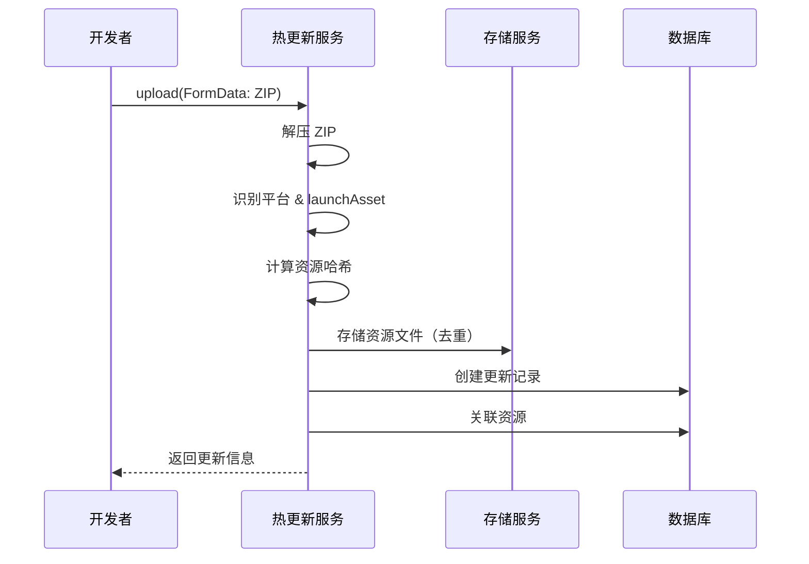
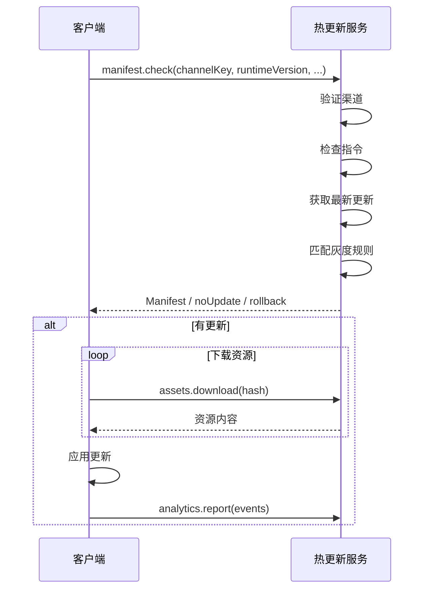

# Hot Update 热更新模块

Expo Code Push 风格的热更新服务，采用全 tRPC 架构，支持灰度发布、回滚和统计分析。

## 架构概览

按使用场景划分为四个子域，路由采用嵌套结构：

```
hot-update/
├── index.ts                    # 域聚合入口
├── README.md                   # 本文档
│
├── manage/                     # 📋 管理后台域（开发者使用）
│   ├── index.ts                # 子域聚合
│   ├── organizations/          # 组织 CRUD
│   ├── projects/               # 项目 CRUD
│   ├── channels/               # 渠道管理 + 签名密钥
│   ├── updates/                # 版本发布
│   │   └── utils/              # Bundle 解压工具
│   ├── directives/             # 回滚指令
│   └── rollout-rules/          # 灰度规则
│
├── storage/                    # 💾 资源存储域
│   ├── index.ts                # 子域聚合
│   ├── assets/                 # 内容寻址存储
│   └── update-assets/          # 更新-资源关联
│
├── protocol/                   # 📡 客户端协议域（App 使用）
│   ├── index.ts                # 子域聚合
│   ├── manifest/               # 检查更新（核心协议）
│   └── analytics/              # 事件上报
│
└── metrics/                    # 📊 统计指标域
    ├── index.ts                # 子域聚合
    └── statistics/             # 统计查询
```

### 子域职责说明

| 子域        | 职责               | 使用者     | 访问频率       |
| ----------- | ------------------ | ---------- | -------------- |
| `manage/`   | 租户管理、发布配置 | 开发者后台 | 低（配置类）   |
| `storage/`  | 资源存储与关联     | 内部服务   | 高（下载）     |
| `protocol/` | 客户端通信协议     | App 客户端 | 高（检查更新） |
| `metrics/`  | 运营统计查询       | 运营后台   | 中（查看报表） |

## 核心 API 端点

### 客户端协议（公开）

| 路由                                      | 类型     | 说明                                    |
| ----------------------------------------- | -------- | --------------------------------------- |
| `hotUpdate.protocol.manifest.check`       | query    | 检查更新，返回 Manifest/无更新/回滚指令 |
| `hotUpdate.storage.assets.download`       | query    | 下载资源（Base64）                      |
| `hotUpdate.storage.assets.downloadStream` | query    | 流式下载资源                            |
| `hotUpdate.protocol.analytics.report`     | mutation | 批量事件上报                            |

### 管理接口（需认证）

| 路由                                      | 类型     | 说明                    |
| ----------------------------------------- | -------- | ----------------------- |
| `hotUpdate.manage.updates.upload`         | mutation | 上传 Bundle（FormData） |
| `hotUpdate.manage.updates.updateSettings` | mutation | 更新设置（启用/灰度）   |
| `hotUpdate.manage.updates.rollback`       | mutation | 回滚到指定版本          |
| `hotUpdate.metrics.statistics.byChannel`  | query    | 渠道统计                |
| `hotUpdate.metrics.statistics.byUpdate`   | query    | 更新统计                |

## 更新发布流程



## 客户端更新流程



## 灰度发布策略

支持多种灰度规则，采用 OR 逻辑：

| 规则类型     | 说明                       |
| ------------ | -------------------------- |
| `percentage` | 按百分比灰度（确定性哈希） |
| `deviceId`   | 指定设备 ID 列表           |
| `header`     | 匹配自定义请求头           |

```typescript
// 示例：10% 灰度 + 指定测试设备
const rules = [
  { type: 'percentage', value: 10 },
  { type: 'deviceId', value: 'test-device-001' },
];
```

## 事件类型

```typescript
const ANALYTICS_EVENT_TYPE = {
  UPDATE_CHECK: 'update_check',
  DOWNLOAD_START: 'download_start',
  DOWNLOAD_COMPLETE: 'download_complete',
  DOWNLOAD_FAILED: 'download_failed',
  APPLY_START: 'apply_start',
  APPLY_SUCCESS: 'apply_success',
  APPLY_FAILED: 'apply_failed',
  ROLLBACK: 'rollback',
};
```

## 环境配置

```bash
# 存储配置
STORAGE_TYPE=local
STORAGE_LOCAL_PATH=./storage

# 未来支持
# STORAGE_TYPE=s3
# S3_BUCKET=my-bucket
# S3_ACCESS_KEY_ID=xxx
# S3_SECRET_ACCESS_KEY=xxx
```

## 模块依赖

```
manage/
├── organizations
│   └── projects
│       └── channels
│           ├── updates ──── storage/assets
│           │     └── storage/update-assets
│           ├── directives
│           └── rollout-rules

protocol/
├── manifest ← channels, updates, directives, rollout-rules, assets
└── analytics ← channels, updates

metrics/
└── statistics ← channels, updates
```

## 类型导出

```typescript
// 从 hot-update 模块导出
export {
  // 路由
  hotUpdateRouter,
  manifestRouter,
  analyticsRouter,
  statisticsRouter,
  // ...

  // 类型
  type CheckUpdateRequest,
  type CheckUpdateResponse,
  type Manifest,
  type ManifestAsset,
  type Platform,
  type AnalyticsEvent,
  type AnalyticsEventType,
  type UpdateStats,
  type ChannelStats,
  // ...

  // 常量
  RESPONSE_TYPE,
  ANALYTICS_EVENT_TYPE,
  // ...
};
```

## 子模块文档

- [Storage 存储模块](../../common/storage/README.md)
- [Manifest 协议模块](./protocol/manifest/README.md)
- [Assets 资源模块](./storage/assets/README.md)
- [Updates 更新模块](./manage/updates/README.md)
- [Analytics 分析模块](./protocol/analytics/README.md)
- [Statistics 统计模块](./metrics/statistics/README.md)
